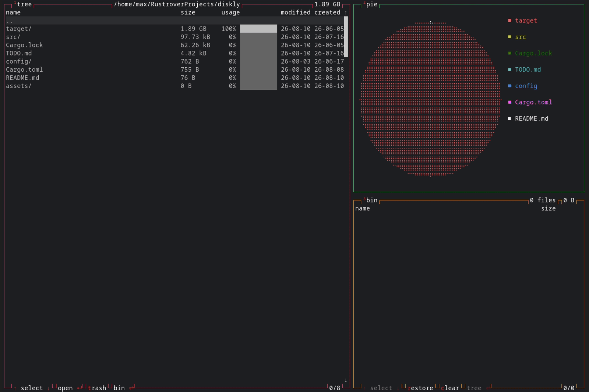

## Description

A disk usage analyzer with directory tree and pie chart visualizations, with safe deletion via the bin.

Visual design inspired by [btop](https://github.com/aristocratos/btop).

## Demo



## Features

- **Fast** — parallel dir scanning via [jwalk](https://github.com/Byron/jwalk)
- **Efficient** — event-driven rendering, low memory footprint
- **Lightweight** — small binary size
- **Easy to use** — intuitive, user-friendly UI
- **Mouse support** — clickable tables and scrollbars (more interactions planned)
- **Pie chart visualization** — a more intuitive view of usage
- **Safe deletion** — trash/bin system makes accidental deletion much harder
- And more...

## Roadmap

Diskly is under active development. Some of the planned features include:

- [ ] TTY mode
- [ ] Menu
- [ ] TUI settings configurator
- [ ] More themes
- [ ] Find largest files/directories
- [ ] File type filtering
- [ ] Publish to package managers

## Installation

Download [latest release](https://github.com/SomethingSomehow/diskly/releases/latest) archive for your platform, extract it, and run diskly.

## Usage

```bash
diskly        # scan current dir
diskly PATH   # scan specified dir
```

## LICENSE

[MIT License](https://github.com/SomethingSomehow/diskly/blob/master/LICENSE)
